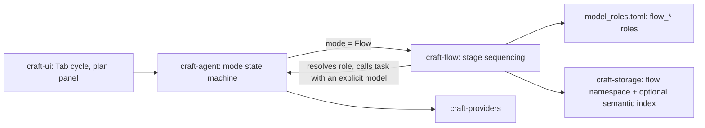
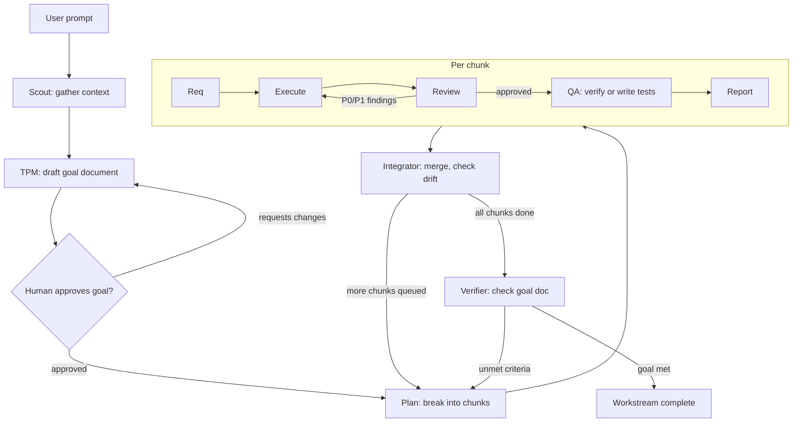

# Design proposal: Flow, a third Craft mode for staged multi-agent workstreams

Status: implementation plan for [craft-build/craft](https://github.com/craft-build/craft), current as of `v0.6.5`.

## 0. Summary

Craft has two modes today: **Build** (full access) and **Plan** (read-only). This is the design and implementation plan for a third mode, **Flow**, that runs a full request through a small SDLC pipeline instead of one long agent turn:

```
scout -> tpm -> [human approves goal] -> plan -> { req -> execute -> review <-> execute -> qa -> report }* -> integrator -> verifier
```

Each stage is a short-lived, narrowly-scoped subagent instead of one agent doing everything in one growing context window. This is Craft's own context-efficiency thesis applied one level up, at the phase level instead of the message level.

Two things make this a Craft-native design rather than a generic pattern grafted on:

- **Persistence** uses a new `<project-path>/flow` namespace, sibling to the existing `<project-path>/memories`, built the same way but without memory's size ceiling, since Flow's documents are addressed by exact path per stage rather than loaded in bulk.
- **Model selection** per stage is independent of the generic weak/medium/strong tiers `task` uses for ad hoc subagents. Each of Flow's stages gets its own named role in `model_roles.toml`, the same mechanism `advisor` already uses, just used several more times.

The rest of Craft's primitives carry the pipeline almost as is. `task`'s `subagent_type`, `isolation`, `context_mode`, and `output_schema` cover the mechanics of launching each stage, and the `review`, `question`, `conflicts`, and `safety` tools already implement several stages in miniature.

> Note on scope: an earlier pass of this proposal read `CONTRIBUTING.md`'s mention of an in-progress Lua migration as a reason to phase this into a small pilot before proposing the full mode. That doesn't apply: Craft maintains a mix of Rust and Lua tools going forward, and this document specifies the full native implementation directly, as one plan.

## 1. Why this fits Craft specifically, not just AI harnesses in general

Craft's own README frames its differentiator as keeping context lean at every step rather than compressing reactively once it overflows: a multi-stage compression pipeline, tools that return skeletons and summaries instead of raw dumps, and subagents that carry their own context windows so delegation does not pollute the main session.

Flow is that same idea at a coarser grain. A single Build-mode session doing a multi-file feature end to end still accumulates the full exploration transcript, every failed attempt, every long file read, and every review round, all in one window, compressed only after the fact. Flow instead never lets that window form. Each stage gets exactly the slice of context it needs (a requirement doc, not the whole history that produced it) and disappears when it is done.

It also extends a precedent Craft already has, just further than tiers. The `task` tool's generic `model_tier` (strong/medium/weak) is meant for ad hoc subagents whose shape isn't known in advance. Flow's stages are the opposite: the same fixed roles run on every workstream, which is exactly the situation `model_roles.toml` already exists for, today just for `advisor`. Giving each Flow stage its own named role in that file, rather than slotting nine different jobs into three generic buckets, is a smaller conceptual leap than it sounds: it is the `advisor` pattern, used several more times.

## 2. Mapping pipeline stages onto what already exists

Every stage below is described as a `task` call plus whatever existing tool does the heavy lifting, so the incremental surface area is visible.

| Stage | Existing primitive it rides on | `subagent_type` | Model role | New code needed |
|---|---|---|---|---|
| Scout | `task` composing `index`, `outline`, `grep`, `glob`, `webfetch`, `websearch` | research | `flow_scout` | None beyond the role entry |
| TPM | `task` with `output_schema` for a goal-document shape | research | `flow_tpm` | A JSON Schema |
| Approval gate | `question` tool | n/a | n/a | None |
| Plan | `task` with `output_schema` for a chunk-list shape; can populate the existing plan/todo panel (Ctrl+T) | research | `flow_plan` | A JSON Schema, panel wiring |
| Req | `task` with `output_schema` for a requirement-doc shape, scoped to one chunk's files only | research | `flow_req` | A JSON Schema |
| Execute | `task`, `isolation: worktree` when chunks run in parallel | general | `flow_execute` | None |
| Review | The existing `review` tool, prompted against the requirement doc as well as the styleguide; `report_finding` / `read_findings` for structured output | (built in) | `flow_review` | A prompt convention, not a tool |
| QA | `task` that inspects coverage against the requirement doc's acceptance criteria and writes tests if missing, then runs them | general | `flow_qa` | None |
| Report | Assembled by the orchestrator from Review's verdict, QA's pass/fail, and diff stats. No LLM call needed by default | n/a | n/a (optionally `flow_report` if prose is wanted) | None |
| Integrator | `task` with `output_schema` for a checkpoint shape, plus the existing `conflicts` tool for merges across worktrees | research then general | `flow_integrator` | A JSON Schema |
| Verifier | `task` with `output_schema`, extending the existing `/goal` + judge goal-completion mechanism to check the structured goal doc's acceptance criteria instead of one free-text string | research | `flow_verifier` | A JSON Schema, and confirming the judge's current hook points against source |

Two things fall out of this table. First, most rows need no new Rust at all, only a well-written prompt and a schema. Second, the only genuinely new tool-shaped work is a handful of JSON Schemas plus the storage and role extensions covered in the next few sections.

### 2.1 Document shapes

Sketched as example objects. In implementation these become JSON Schemas passed to `task`'s `output_schema`.

Goal document (TPM):
```json
{
  "workstream_id": "flow-20260703-161045-9c2a",
  "objective": "Add refresh-token support to the auth module",
  "in_scope": ["token refresh endpoint", "client retry on 401"],
  "out_of_scope": ["SSO providers", "session UI changes"],
  "acceptance_criteria": [
    "expired access tokens are refreshed transparently once",
    "a second consecutive 401 surfaces to the caller"
  ],
  "assumptions": ["refresh tokens are already issued at login"],
  "open_questions": [],
  "risk_notes": "touches the shared http client used by three other modules"
}
```

Plan document (Plan):
```json
{
  "workstream_id": "flow-20260703-161045-9c2a",
  "chunks": [
    {
      "chunk_id": "c1",
      "title": "Add refresh endpoint",
      "touches_paths": ["src/auth/refresh.rs", "src/auth/routes.rs"],
      "depends_on": [],
      "parallel_group": 1
    },
    {
      "chunk_id": "c2",
      "title": "Wire client retry on 401",
      "touches_paths": ["src/http/client.rs"],
      "depends_on": ["c1"],
      "parallel_group": 2
    }
  ]
}
```

There is deliberately no per-chunk model hint here. Execute always runs under the `flow_execute` role (section 5); if a project wants a harder chunk on a stronger model, that is a `model_roles.toml` edit, not a plan-time decision.

Requirement document, QA report, integration checkpoint, and verification report follow the same pattern: small, flat, and specific. Full shapes are in the appendix rather than repeated here.

## 3. Persistence: a dedicated `flow` namespace, sized for pipeline state, not curated notes

The `memory` tool today reads and writes relative paths under `<project-path>/memories`, and that store carries a size restriction suited to its actual job: a curated, hand-written scratchpad that's meaningful to consider in bulk (that's what `/dream` does when it consolidates memory). Flow's documents are a different shape entirely: machine-generated, addressed by exact path, and never loaded in bulk. Forcing them through the same size ceiling either caps how much a workstream can hold or quietly displaces genuine project memory.

The fix is a second, sibling namespace: `<project-path>/flow`, alongside `<project-path>/memories`, not subject to the aggregate size restriction that applies to the latter. The `memory` tool's interface stays exactly as is (view, write, delete, relative paths); the storage layer routes a `flow/...` path to the new root instead of the existing one and skips the size check for it, since the failure mode that check guards against (an ever-growing pile of text silently bloating every turn) does not apply to a store nothing reads in bulk.

Layout:
```
<project-path>/flow/<workstream_id>/scout/codebase.md
<project-path>/flow/<workstream_id>/scout/research.md
<project-path>/flow/<workstream_id>/goal.md
<project-path>/flow/<workstream_id>/plan.md
<project-path>/flow/<workstream_id>/chunks/<chunk_id>/requirement.md
<project-path>/flow/<workstream_id>/chunks/<chunk_id>/review.md
<project-path>/flow/<workstream_id>/chunks/<chunk_id>/qa.md
<project-path>/flow/<workstream_id>/chunks/<chunk_id>/report.md
<project-path>/flow/<workstream_id>/integration/<n>.md
<project-path>/flow/<workstream_id>/verification.md
```

Removing the aggregate cap doesn't mean removing all governance. Two small, cheap additions are worth including from the start:
- a generous per-document size ceiling, purely to catch a stage that runs away and dumps something pathological, not to constrain normal use
- a prune path for old workstreams (`craft flow gc --older-than 30d` or similar), since without the aggregate cap, disk usage across many historical workstreams only ever grows

Once a workstream's accumulated documents get large enough that pasting the relevant ones into a stage's prompt stops being practical (a large monorepo, a long-running workstream with many chunks), the same optional semantic layer discussed in section 9 sits on top of this namespace without changing anything about how it's written to.

## 4. Stage prompt templates

craft-flow's state machine constructs each stage's `task` prompt from a template, substituting in the workstream ID, chunk ID, and the specific `flow/...` paths relevant right now. A project can override any single stage's template by dropping a matching file under `.craft/flow/<stage>.md`, mirroring how skill overrides work, without needing to fork the crate. Two representative templates:

Scout (constructed once per workstream):
```
Gather codebase and library context relevant to: {user_request}

Use index, outline, grep, glob, websearch, and webfetch as needed. Write your
findings to:
- flow/{workstream_id}/scout/codebase.md: relevant files, structures, and
  conventions already in the repo
- flow/{workstream_id}/scout/research.md: relevant external library or API
  documentation, if any

Do not modify any files. Do not implement anything yet.
```
(`subagent_type: research`, role `flow_scout`, `context_mode: none`)

Execute (constructed per chunk, and again on each review retry):
```
Implement exactly what is described in
flow/{workstream_id}/chunks/{chunk_id}/requirement.md. Read that file first.
Do not implement anything outside its stated scope.

{on retry only:}
The previous attempt failed review. Findings:
{findings}
Address every P0 and P1 finding above before making any other change.
```
(`subagent_type: general`, role `flow_execute`, `isolation: worktree` if this chunk's `parallel_group` is running alongside others)

Review is not a template, it's a direct call to the existing tool:
```
review(
  task: "Verify chunk {chunk_id} against flow/{workstream_id}/chunks/{chunk_id}/requirement.md, in addition to normal styleguide rules",
  focus_files: {chunk.touches_paths}
)
```
craft-flow then calls `read_findings`; any P0 or P1 sends the chunk back to Execute with those findings appended, up to `max_review_iterations`.

TPM, Plan, Req, QA, Integrator, and Verifier follow the same shape as Scout and Execute: a short, scoped instruction, the exact `flow/...` paths to read and write, and an `output_schema` where the table in section 2 calls for one.

## 5. Model roles, independent of tiers

Every Flow stage resolves its model through a dedicated named role in `model_roles.toml`, not through the generic `model_tier` parameter `task` exposes elsewhere. This is a deliberate difference from how ad hoc subagents pick a model, for a simple reason: Flow's stages aren't ad hoc. The same roles run on every workstream, so each one earns its own line rather than being squeezed into one of three generic buckets.

```toml
[roles]
# illustrative model strings, set these to whatever's current
flow_scout      = "anthropic/claude-haiku-4-5"
flow_tpm        = "anthropic/claude-sonnet-4-6"
flow_plan       = "anthropic/claude-opus-4-8"
flow_req        = "anthropic/claude-sonnet-4-6"
flow_execute    = "anthropic/claude-sonnet-4-6"
flow_review     = "anthropic/claude-opus-4-8"
flow_qa         = "anthropic/claude-sonnet-4-6"
flow_integrator = "anthropic/claude-sonnet-4-6"
flow_verifier   = "anthropic/claude-opus-4-8"
```

This needs one small, additive extension to the subagent launch path: today it accepts `model_tier`, and Flow needs it to also accept an explicit, already-resolved model identifier, which craft-flow passes after looking up the role. Every other caller of `task` keeps using tiers exactly as before; this is a second way in, not a replacement for the first.

Shipping sensible defaults for all of these roles matters as much as the mechanism. If Flow requires nine manual `model_roles.toml` entries before it runs at all, most users will never turn it on. The defaults above should work out of the box, on the theory that the "advisor falls back to the active model" pattern already used for that role should apply here too: an unset `flow_*` role falls back to the active session model rather than failing.

## 6. Mode plumbing

- Extend the enum backing the current build/plan mode field (referenced in the session docs as "session mode (build/plan)") with a third `Flow` variant.
- Tab-cycling in the input box goes Build to Plan to Flow to Build, matching the existing two-way toggle becoming three-way.
- `Ctrl+T`'s plan/todo panel is reused for Flow's chunk list instead of building a new panel: the Plan stage's chunk array populates the same panel Plan mode already shows, with a status glyph per chunk (queued, running, needs review, blocked, done).
- New CLI entry point `craft flow "<request>"`, parallel to how `craft acp` is already its own subcommand-like entry point, plus `craft --mode flow "<request>"` for scripting parity with `--mode`-style flags elsewhere.

## 7. Headless pause and resume around the approval gate

Headless mode already returns a `session_id` in JSON output and accepts `-s/--session` to resume, and interactive sessions already restore mode, plan, and goal on load. Flow's one interactive checkpoint (goal approval) maps onto that directly:

```bash
$ craft flow "add OAuth login" --print --output-format json
{"stop_reason": "awaiting_goal_approval", "session_id": "f83a...", "result": "<goal doc>", ...}

$ craft -s f83a... --mode flow -p "approved" --output-format json
{"stop_reason": "awaiting_goal_approval", ...}   # if TPM revised something worth re-confirming

$ craft -s f83a... --mode flow -p "approved, also cover refresh tokens"
```
A CI script or a bot can treat this like the existing Claude-Code-compatible JSON contract, with one more `stop_reason` value to branch on.

## 8. Configuration

Follows the existing `agent.validation` / `agent.small_model` shape: a namespaced table, an `enabled` flag, small tunables, bounded iteration counts. Model selection is deliberately absent here, it lives entirely in `model_roles.toml` per section 5.

```lua
craft.setup({
    flow = {
        enabled = true,
        max_review_iterations = 3,
        max_qa_iterations = 2,
        parallel_chunks = 1, -- raise once the Integrator merge path has real mileage on it
        semantic_index = false, -- see 9.1
    },
})
```

## 9. Storage and crate architecture

### 9.1 `craft-storage` extension

Add a `flow` module to `craft-storage` alongside the existing session and auth persistence, implementing the `<project-path>/flow` namespace from section 3: structured records addressed by path and stage, not appended to like a conversation transcript, with the per-document ceiling and prune command from that section.

The optional semantic layer sits on top of this, gated by `flow.semantic_index`, and reuses the existing ONNX/fastembed feature rather than adding a new dependency: a flat embedding index per workstream, populated as documents are written, exposed to stages through a small `flow_search(workstream_id, query, k)` tool. It only turns on for workstreams whose accumulated documents exceed a size threshold, so the common case never pays for it.

### 9.2 The `craft-flow` crate

A new crate, matching the one-crate-per-subsystem pattern (`craft-interpreter` for `code_execution`, `craft-acp` for the ACP server). It depends on `craft-agent` (to hook into the mode state machine and call `task` the same way the agent loop already does), `craft-storage` (for 9.1), and `craft-tool-macro` (for the schemas backing `output_schema` calls and the `flow_search` tool definition). Landing a new Rust crate alongside the existing Lua plugins is a normal shape for this codebase: Craft maintains both natively, and a stage-sequencing state machine with schema-validated hand-offs is exactly the kind of thing that wants to be native rather than scripted.

### 9.3 Component diagram



### 9.4 Pipeline flow



## 10. Failure handling reuses existing mechanisms, on purpose

- **Review to Execute retries**: bounded the same way `agent.validation.max_iterations` already bounds compile-check retries, via `flow.max_review_iterations`, not an open-ended loop.
- **Escalation on repeated failure**: Flow does not inherit the generic tier-escalation mechanism, since its stages no longer sit on tiers. If a loop exhausts its retry budget, the orchestrator surfaces it to the human rather than silently swapping models. A project that wants an automatic step up can point a stage's role at a stronger model directly, or add its own convention (an unused role name a loop falls back to after N failures); either is config, not new mechanism.
- **Tool trust decay**: if a stage's tool calls start failing repeatedly (a flaky `webfetch` during Scout, say), the existing trust-decay mechanism already demotes or drops that tool rather than Flow needing its own circuit breaker.
- **Merge conflicts across parallel chunks**: the existing `conflicts` tool, with `@theirs` / `@ours` / `@base` resolution, is what Integrator calls when worktrees do not merge cleanly, not a bespoke merge algorithm.
- **Rollback**: Execute's writes are already auto-snapshotted by the `safety` tool before every `write` / `edit` / `multiedit`. If a chunk needs to be abandoned mid-flight, `/undo` or `safety restore` already does it.
- **Sandbox scoping per stage**: research-type stages run under `sandbox.mode = read_only`, general-type stages under `workspace_write`, using the sandbox modes that already exist rather than a parallel permission system.

## 11. Build vs Plan vs Flow

| | Build | Plan | Flow |
|---|---|---|---|
| Access | Full | Read-only | Mixed, per stage |
| Typical duration | One sitting | One sitting | Minutes to hours, resumable |
| Context per stage | Whole session | Whole session | One stage's slice only |
| Model selection | Whatever the session has active | Whatever the session has active | Independent named role per stage |
| Human touchpoints | Continuous | Continuous | One approval gate, then async |
| Best for | A change you can hold in your head | Scoping before committing | Anything you'd naturally write a ticket for |
| Overhead for a 5-line fix | Low | Low | Too much, use Build instead |

That last row matters. Flow should not be the default for small edits: five sequential `task` calls with schema validation to fix a typo is worse than one Build-mode turn. Flow is for requests that would already, in a human team, become a ticket with acceptance criteria and a review, not for everything.

## 12. Risks and open questions

- **The "judge" goal-completion mechanism is only mentioned in passing** in the docs (as something `agent.advisor` is distinct from) and has no dedicated page. Verifier's design in section 2 assumes it can be extended to check structured criteria instead of one free-text `/goal` string; that assumption needs confirming against the actual implementation before this is built, not just against the docs.
- **`isolation: worktree` for parallel chunks is real but untested at this scale.** It exists for exactly this purpose, but running several worktree-isolated `general` subagents concurrently, then integrating them, is a heavier use of that feature than a single ad hoc subagent. `parallel_chunks` defaults to 1 for this reason (section 8); raise it once Integrator's merge path has been exercised for real, not before.
- **Schema-validated `output_schema` calls add latency and cost per stage.** For a genuinely small chunk, the fixed overhead of req/execute/review/qa/report as five separate calls can exceed just doing it in Build mode. This is the same tradeoff as the last row of section 11, worth measuring rather than assuming.
- **Nine roles is a lot of config surface if the defaults are wrong.** Shipping working defaults that fall back to the active session model when unset (section 5) is not optional polish, it's what makes Flow usable on the first run instead of requiring setup before anyone can try it.
- **No aggregate cap on the `flow` namespace means unbounded growth is possible without the ceiling and prune path from section 3.** Those two additions are small, but skipping them turns "no size restriction" into a real disk-usage problem over many workstreams.

## 13. Implementation plan

1. Write the JSON Schemas for the document types in section 2.1 and the appendix, and the default prompt templates for each stage (section 4).
2. Extend `craft-storage` with the `flow` namespace: project-relative `<project-path>/flow`, no aggregate cap, a per-document size ceiling, and a prune command (section 3, 9.1).
3. Add the `flow_*` roles to `model_roles.toml` with working defaults, and extend the subagent launch path to accept an explicit resolved model alongside the existing tier parameter (section 5).
4. Build the `craft-flow` crate: the stage state machine, `task`-call wiring per stage, the bounded review-to-execute loop, and QA's coverage check plus test-writing step (section 9.2).
5. Wire mode plumbing: add `Flow` to the mode enum, Tab-cycle support, the `craft flow` CLI entry point, and session persistence/resume of Flow-specific state such as current stage and chunk statuses (section 6).
6. Wire the approval gate: `question`-tool integration for interactive use, and the `awaiting_goal_approval` stop reason plus resume path for headless and CI use (section 7).
7. Wire the Plan stage's chunk list into the existing Ctrl+T plan/todo panel (section 6).
8. Add the optional semantic index over the `flow` namespace, gated by `flow.semantic_index`, built on the existing `onnx` feature (section 9.1).
9. Run it end to end on a real, medium-sized feature in Craft's own codebase, then write the docs page.

---

## Appendix: remaining document shapes

Requirement document (Req):
```json
{
  "chunk_id": "c1",
  "summary": "Add POST /auth/refresh accepting a refresh token, returning a new access token",
  "must_implement": ["endpoint handler", "token validation", "error on expired refresh token"],
  "interfaces": ["reuses existing TokenStore trait, does not change its signature"],
  "edge_cases": ["reused refresh token", "clock skew within 60s"],
  "non_goals": ["rotating the refresh token itself"],
  "acceptance_criteria": ["valid refresh token returns 200 with a new access token", "expired refresh token returns 401"]
}
```

QA report:
```json
{
  "chunk_id": "c1",
  "tests_added": ["src/auth/refresh.rs::test_refresh_valid_token", "src/auth/refresh.rs::test_refresh_expired_token"],
  "tests_run": "cargo nextest run --all-features -p auth",
  "pass": true,
  "coverage_notes": "clock skew edge case not covered, flagged for review"
}
```

Integration checkpoint (Integrator):
```json
{
  "workstream_id": "flow-20260703-161045-9c2a",
  "chunks_integrated": ["c1"],
  "conflicts_found": 0,
  "plan_drift_notes": "none, chunk c2 still pending as planned",
  "recommendation": "continue"
}
```

Verification report (Verifier):
```json
{
  "workstream_id": "flow-20260703-161045-9c2a",
  "goal_met": true,
  "unmet_criteria": [],
  "regressions_found": [],
  "final_verdict": "ship"
}
```

## Sources consulted

The pages below cover Craft's public-facing behavior. A few specifics used in this document (the exact `memories` storage path and its size restriction, and the project's actual stance on maintaining a mix of Rust and Lua going forward) were confirmed directly rather than found in these pages, and are flagged inline where used.

- [github.com/craft-build/craft](https://github.com/craft-build/craft) (README, repo layout, releases, languages)
- [craft-build.github.io/craft/index.html](https://craft-build.github.io/craft/index.html) (feature overview)
- [.../quick-start.html](https://craft-build.github.io/craft/quick-start.html)
- [.../usage.html](https://craft-build.github.io/craft/usage.html) (Build/Plan mode definitions)
- [.../tools.html](https://craft-build.github.io/craft/tools.html) (`task`, `review`, `memory`, `skill`, `question`, `conflicts`, `safety`, `code_execution`, styleguide tools)
- [.../sessions.html](https://craft-build.github.io/craft/sessions.html) (session storage format, headless resume)
- [.../configuration.html](https://craft-build.github.io/craft/configuration.html) (config schema, `model_roles.toml` reference, semantic feature flag)
- [.../commands.html](https://craft-build.github.io/craft/commands.html) (built-in and custom commands)
- [.../headless.html](https://craft-build.github.io/craft/headless.html) (`--print`, JSON contract, Claude Code compatibility)
- [.../skills.html](https://craft-build.github.io/craft/skills.html)
- [.../permissions.html](https://craft-build.github.io/craft/permissions.html) (sandbox modes, permission layering)
- [github.com/craft-build/craft/blob/main/AGENTS.md](https://github.com/craft-build/craft/blob/main/AGENTS.md) (crate architecture, code style, testing)
- [github.com/craft-build/craft/blob/main/CONTRIBUTING.md](https://github.com/craft-build/craft/blob/main/CONTRIBUTING.md) (contribution norms)
